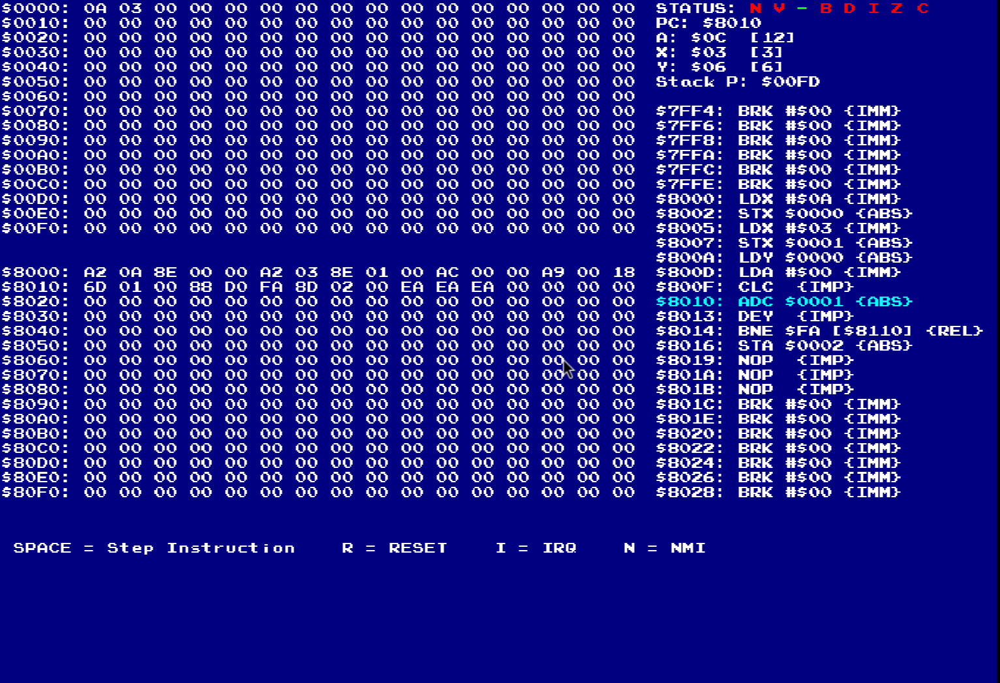

# 🎮 NES-Nova

A **work-in-progress NES Emulator** written in **C++**, built mainly as a learning project to understand classic console hardware and low-level emulation.

Right now, the **6502 CPU core is implemented**, and the project is expanding toward full NES functionality (PPU, APU, cartridge mappers, etc).

---

## 📸 Screenshots / Progress Images


### CPU Debug Output



---

## ✅ Features (So Far)

- 6502 CPU implementation (NES variant / 2A03)
- Opcode decoding + execution
- Addressing modes
- Stack operations
- Status flag handling
- Basic bus interface
- Cycle counting *(still being validated)*

---


---

## 🛠️ How to Build and Run

```sh
cd CPU
make
./nes
```

This will run the program, press space to step through instructions. Instructions will be visible on the right hand side. The 0th and 8th Page of Memory is also visible on the left hand side of the program.

## 🧪 How To Test
Navigate to CPU/main.cpp, In the OnUserCreate() function add the assembled 6502 program in hex inside of the string stream ss. Then make, and run nes and step through the instructions to see if the cpu is working appropriately.

For testing I recommend going through the Instruction Reference, and checking if each instruction works or not. Write the code in assembly and then assemble it at -->
https://www.masswerk.at/6502/assembler.html

Credits to olc for the testing software.

## 🚧 What to work on next
--> This is merely the cpu which beautifully does nothing alone so we need a ppu, alu, memory mapping, roms everything

--> I havent tested each instruction yet so the cpu needs a bunch of testing before it gets completely validated

--> In 6502.cpp the lookup vector is needlessly too long to be kept in a main cpp file so I'd like it to get shifted to another .inl file where it can be accessed from

--> This is not exactly an accurate emulation as it does not support the unofficial opcodes, if someone goes through the wiki for it and edits the project to include them, that will be very helpful.

## 📚 References

Youtube Playlist: https://www.youtube.com/watch?v=nViZg02IMQo&list=PLrOv9FMX8xJHqMvSGB_9G9nZZ_4IgteYf

Instruction Reference: https://www.nesdev.org/wiki/Instruction_reference

NES dev wiki: https://www.nesdev.org/wiki/Emulators
